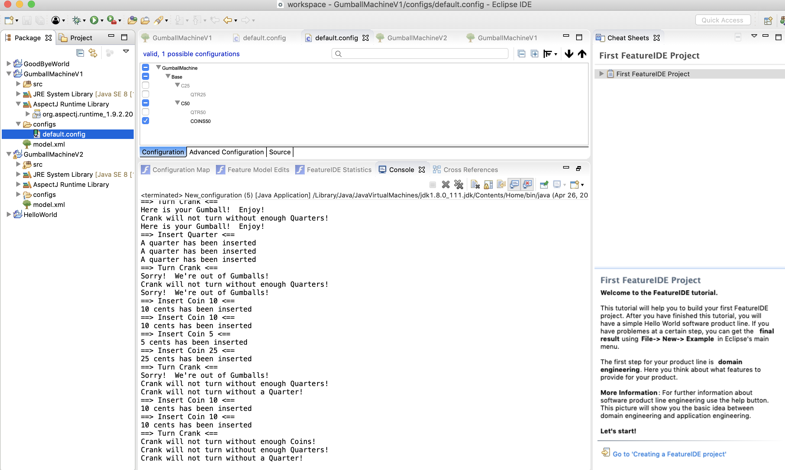
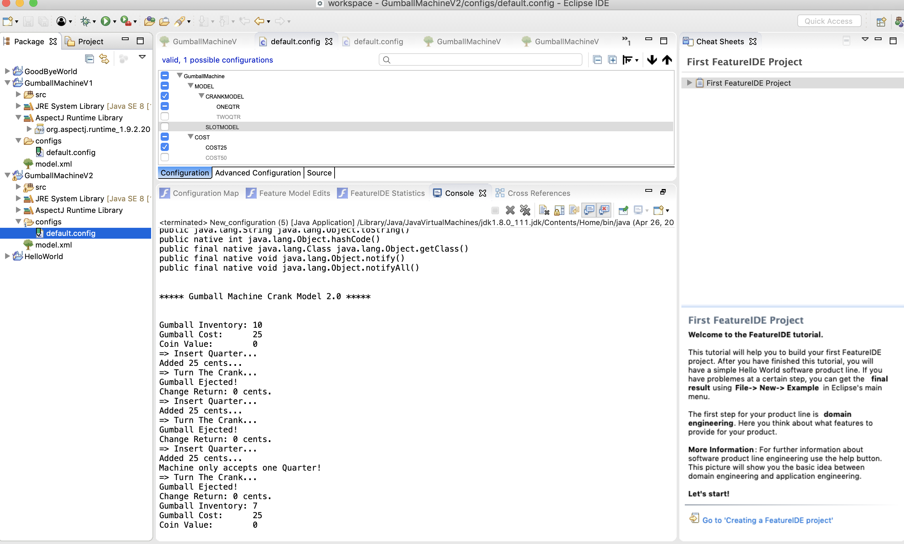
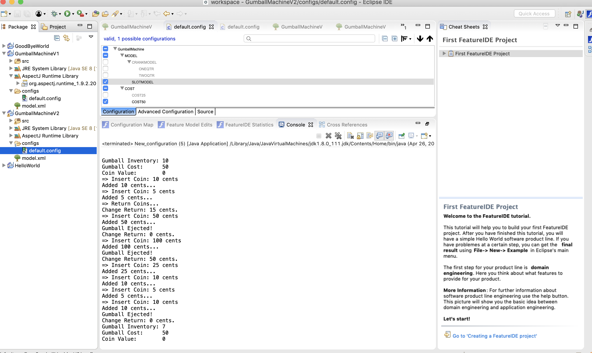

Aop allows no change on the original code between models and it is more convenient on maintenance when requirement changes. You can simpliy add and  select different options to generate needed aspect files instead of writing code in one place.

